# Twelve Links of Dependent Origination - Sequential Flow

## Overview
This visualization presents the Twelve Links of Dependent Origination (རྟེན་འབྲེལ་ཡན་ལག་བཅུ་གཉིས / द्वादशाङ्गप्रतीत्यसमुत्पाद / द्वादसङ्गपटिच्चसमुप्पाद) in their traditional sequential order, showing how each link conditions the arising of the next.

## Visualization

```mermaid
%%{init: {'theme':'neutral', 'themeVariables': {'primaryColor': '#ffd700'}}}%%
graph LR
    A[1. Ignorance<br>Sanskrit: अविद्या<br>Pali: अविज्जा<br>Tibetan: མ་རིག་པ] -->|Conditions| B[2. Formations<br>Sanskrit: संस्कार<br>Pali: सङ्खार<br>Tibetan: འདུ་བྱེད]
    B -->|Conditions| C[3. Consciousness<br>Sanskrit: विज्ञान<br>Pali: विञ्ञाण<br>Tibetan: རྣམ་ཤེས]
    C -->|Conditions| D[4. Name & Form<br>Sanskrit: नामरूप<br>Pali: नामरूप<br>Tibetan: མིང་གཟུགས]
    D -->|Conditions| E[5. Six Senses<br>Sanskrit: षडायतन<br>Pali: सळायतन<br>Tibetan: སྐྱེ་མཆེད་དྲུག]
    E -->|Conditions| F[6. Contact<br>Sanskrit: स्पर्श<br>Pali: फस्स<br>Tibetan: རེག་པ]
    F -->|Conditions| G[7. Feeling<br>Sanskrit: वेदना<br>Pali: वेदना<br>Tibetan: ཚོར་བ]
    G -->|Conditions| H[8. Craving<br>Sanskrit: तृष्णा<br>Pali: तण्हा<br>Tibetan: སྲེད་པ]
    H -->|Conditions| I[9. Grasping<br>Sanskrit: उपादान<br>Pali: उपादान<br>Tibetan: ལེན་པ]
    I -->|Conditions| J[10. Becoming<br>Sanskrit: भव<br>Pali: भव<br>Tibetan: སྲིད་པ]
    J -->|Conditions| K[11. Birth<br>Sanskrit: जाति<br>Pali: जाति<br>Tibetan: སྐྱེ་བ]
    K -->|Conditions| L[12. Aging & Death<br>Sanskrit: जरामरण<br>Pali: जरामरण<br>Tibetan: རྒ་ཤི]

    style A fill:#ffebcd
    style B fill:#ffd700
    style C fill:#98fb98
    style D fill:#87ceeb
    style E fill:#dda0dd
    style F fill:#f0e68c
    style G fill:#ffb6c1
    style H fill:#add8e6
    style I fill:#f08080
    style J fill:#90ee90
    style K fill:#d3d3d3
    style L fill:#ffdab9
```

## Description
This sequential flow shows how each link in the chain of dependent origination conditions the arising of the next. The progression demonstrates how ignorance ultimately leads to suffering through a series of causal connections. Each link is presented in English with its Sanskrit, Pali, and Tibetan equivalents.

## Notes
- Key Features:
  - Each link flows directly into the next, showing immediate conditioning
  - Color coding helps distinguish different links
  - Trilingual presentation preserves traditional terminology
  - Directional flow shows forward progression

- Traditional Understanding:
  - Each "conditions" arrow represents "paccaya" (Pali) or "pratyaya" (Sanskrit)
  - The sequence can be studied forwards (anuloma) or backwards (pratiloma)
  - Breaking the chain at any point can interrupt the cycle
  - Understanding this sequence is key to liberation

- Practice Implications:
  - Meditation focuses on understanding these connections
  - Each link provides an opportunity for intervention
  - The sequence shows both the problem and solution
  - Understanding this flow is essential for insight practice