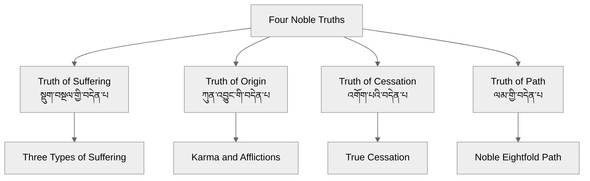

# Four Noble Truths (བདེན་པ་བཞི / चत्वारि आर्यसत्यानि)

## Overview
The Four Noble Truths (བདེན་པ་བཞི) constitute the essence of the Buddha's first teaching after his enlightenment.

## Core Elements

## Key Terms
| Term | Tibetan | Sanskrit | English |
|------|----------|-----------|----------|
| Four Noble Truths | བདེན་པ་བཞི | चत्वारि आर्यसत्यानि | Four Noble Truths |
| Suffering | སྡུག་བསྔལ | दुःख | Suffering |
| Origin | ཀུན་འབྱུང | समुदय | Origin |
| Cessation | འགོག་པ | निरोध | Cessation |
| Path | ལམ | मार्ग | Path |

## Related Principles
- Noble Eightfold Path
- Twelve Links of Dependent Origination
- Three Types of Suffering

## Sources
- Dhammacakkappavattana Sutta
- Abhidharmakośa
- Lamrim Chenmo