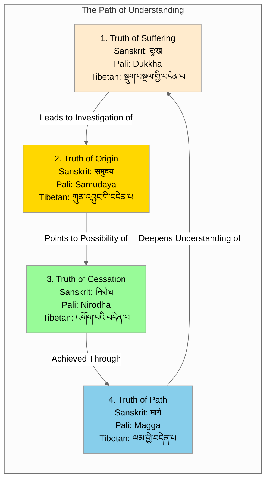

# Four Noble Truths - Cycle View

## Overview
This visualization presents the Four Noble Truths:
- Tibetan: བདེན་པ་བཞི
- Sanskrit: चत्वारि आर्यसत्यानि
- Pali: Cattāri Ariyasaccāni

## Visualization

## Description
This cycle visualization demonstrates the dynamic relationship between the Four Noble Truths across all three classical Buddhist languages, showing how they form a complete system of understanding and practice. The cycle begins with recognizing suffering (dukkha/दुःख/སྡུག་བསྔལ), which naturally leads to investigating its causes (samudaya/समुदय/ཀུན་འབྱུང). Understanding these causes reveals the possibility of cessation (nirodha/निरोध/འགོག་པ), which is achieved through the path (magga/मार्ग/ལམ).

## Notes
- Key aspects of the cycle:
  - Each truth is presented in all three classical languages, reflecting the complete transmission lineage
  - The progression shows both the logical development of understanding and the practical sequence of realization
  - The cycle is self-reinforcing, with each revolution deepening understanding
  - Color coding reflects different aspects: recognition (peach), causation (gold), possibility (green), and method (blue)

- Language and Transmission:
  - Pali: Represents the earliest recorded teachings (Theravada tradition)
  - Sanskrit: Reflects the later Mahayana developments
  - Tibetan: Shows the transmission to Tibet and subsequent preservation

- Transformations between states:
  1. Recognition of dukkha/दुःख/སྡུག་བསྔལ leads to investigating its causes
  2. Understanding samudaya/समुदय/ཀུན་འབྱུང reveals the possibility of freedom
  3. Seeing nirodha/निरोध/འགོག་པ motivates following the path
  4. Following magga/मार्ग/ལམ deepens understanding of suffering

- Traditional interpretations:
  - This cyclic presentation reflects the Buddha's own process of realization
  - The continuous nature of the cycle shows how understanding is progressively refined
  - Each revolution represents a deeper level of realization
  - The interconnected nature reflects dependent origination (पटिच्चसमुप्पाद/प्रतीत्यसमुत्पाद/རྟེན་འབྲེལ)

- Practice implications:
  - Practitioners can use this cycle as a contemplation framework
  - Each transition point suggests specific meditation practices
  - The cycle supports both analytical and experiential understanding
  - Progress is made through repeated engagement with each truth