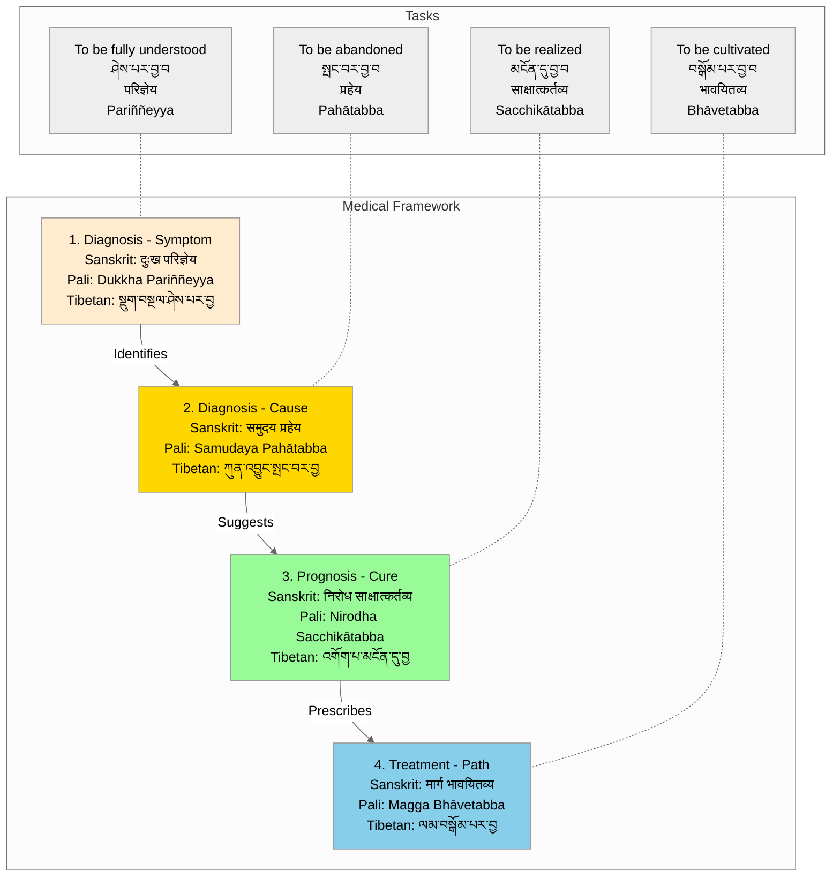

# Four Noble Truths - Diagnostic View

## Overview
This visualization presents the Four Noble Truths:
- Tibetan: བདེན་པ་བཞི
- Sanskrit: चत्वारि आर्यसत्यानि
- Pali: Cattāri Ariyasaccāni

as a medical diagnostic framework, following the Buddha's analogy of a physician diagnosing and treating an illness.

## Visualization

## Description
This diagnostic visualization presents the Four Noble Truths using the Buddha's medical analogy, where he compared himself to a physician and his teaching to a medical treatment. Each truth corresponds to a stage in the medical process, with specific tasks associated with each stage. The diagram includes the terms in all three classical languages, along with the specific task or approach required for each truth.

## Notes
- Medical Framework Components:
  1. Diagnosis (Symptom): Suffering must be fully understood
     - Sanskrit: दुःख परिज्ञेय (Duḥkha Parijñeya)
     - Pali: Dukkha Pariññeyya
     - Tibetan: སྡུག་བསྔལ་ཤེས་པར་བྱ
  
  2. Diagnosis (Cause): Origin must be abandoned
     - Sanskrit: समुदय प्रहेय (Samudaya Praheya)
     - Pali: Samudaya Pahātabba
     - Tibetan: ཀུན་འབྱུང་སྤང་བར་བྱ
  
  3. Prognosis (Cure): Cessation must be realized
     - Sanskrit: निरोध साक्षात्कर्तव्य (Nirodha Sākṣātkartavya)
     - Pali: Nirodha Sacchikātabba
     - Tibetan: འགོག་པ་མངོན་དུ་བྱ
  
  4. Treatment (Path): Path must be cultivated
     - Sanskrit: मार्ग भावयितव्य (Mārga Bhāvayitavya)
     - Pali: Magga Bhāvetabba
     - Tibetan: ལམ་བསྒོམ་པར་བྱ

- Traditional Significance:
  - The medical analogy appears in early Buddhist texts including the Dhammacakkappavattana Sutta
  - Each truth has a specific task associated with it, indicated by different verbal forms
  - This framework emphasizes both theoretical understanding and practical application
  - The systematic approach reflects the Buddha's analytical method

- Practical Application:
  - Each stage requires a different approach or method
  - The framework provides clear guidance for practice
  - Understanding progresses from recognition to active engagement
  - The tasks show how theory translates into practice

- Linguistic Notes:
  - Each truth has associated verbal forms indicating the required action
  - The terminology shows remarkable consistency across traditions
  - Technical terms are preserved in all three classical languages
  - The tasks (fully understand, abandon, realize, cultivate) are consistent across traditions