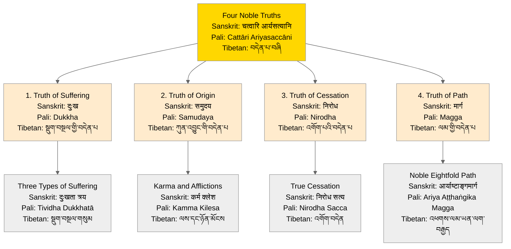

# Four Noble Truths - Hierarchical View

## Overview
This visualization presents the Four Noble Truths:
- Tibetan: བདེན་པ་བཞི
- Sanskrit: चत्वारि आर्यसत्यानि
- Pali: Cattāri Ariyasaccāni

## Visualization

## Description
This hierarchical diagram illustrates the Four Noble Truths with their complete classical language nomenclature. Each truth is presented in English along with its Sanskrit, Pali, and Tibetan translations, showing both its individual significance and its relationship to the whole teaching. The secondary level shows the key components of each truth that are explored in deeper Buddhist teachings, also presented in all three classical languages.

## Notes
- Key features of this hierarchical representation:
  - Primary presentation in all three classical Buddhist languages reflects the complete transmission lineage
  - Each truth is numbered to show traditional sequence
  - Secondary concepts show how each truth branches into more detailed teachings
  - Color coding distinguishes the main concept from its components

- Language and Transmission:
  - Pali terms represent the earliest recorded Buddhist canon (Tipiṭaka)
  - Sanskrit terms reflect later developments and Mahayana traditions
  - Tibetan terms show the transmission and preservation in the Tibetan tradition

- Important relationships:
  1. The Truth of Suffering (दुःख/Dukkha/སྡུག་བསྔལ) branches into the Three Types of Suffering
  2. The Truth of Origin (समुदय/Samudaya/ཀུན་འབྱུང) connects to Karma and Afflictions
  3. The Truth of Cessation (निरोध/Nirodha/འགོག་པ) links to True Cessation
  4. The Truth of Path (मार्ग/Magga/ལམ) leads to the Noble Eightfold Path

- Traditional significance:
  - The hierarchical structure reflects traditional teaching methodology
  - The inclusion of all three languages shows the preservation across Buddhist cultures
  - The secondary level concepts indicate the depth of analysis in Buddhist philosophy
  - The relationship between primary and secondary concepts shows how basic teachings lead to deeper understanding

- Educational implications:
  - Provides a clear framework for studying Buddhism across different traditions
  - Shows the consistency of core concepts across languages and cultures
  - Helps students understand the relationship between basic and advanced teachings
  - Supports comparative study of Buddhist terminology