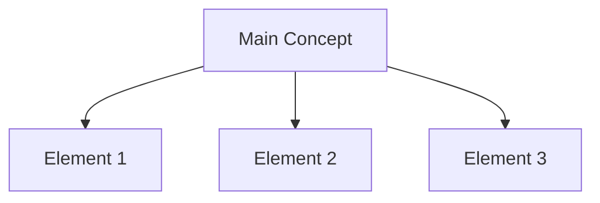

# [Principle Name] ([Tibetan] / [Sanskrit])

## Overview
Brief explanation of the principle and its significance.

## Core Elements

## Variations
- Link to different visual representations
- Reference to different traditions or presentations

## Key Terms
| Term | Tibetan | Sanskrit | English |
|------|----------|-----------|----------|
| | | | |

## Related Principles
- Link to related principles
- Brief explanation of relationship

## Sources
- Primary texts
- Key commentaries
- Contemporary references