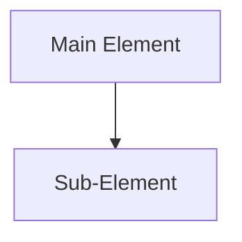

# [Principle Name] - [Visualization Type]

## Diagram

## Explanation
- Purpose of this visualization
- Key points illustrated
- How to read/interpret the diagram

## Alternative Representations
- Links to other visualizations of same principle
- Notes on when to use this representation

## Usage Notes
- Teaching context
- Common questions
- Points to emphasize