# {name} - Comparative View

## Overview
This visualization presents {name} ({tibetan} / {sanskrit} / {pali}) across different interpretative traditions.

## Visualization

```mermaid
%%{init: {'theme':'neutral', 'themeVariables': {'primaryColor': '#ffd700'}}}%%
graph TD
    subgraph Tradition_1["Early Buddhist (Theravāda)"]
        A1[Concept<br>Pali<br>English] --> B1[Interpretation 1<br>Pali<br>English]
    end

    subgraph Tradition_2["Mahāyāna"]
        A2[Concept<br>Sanskrit<br>English] --> B2[Interpretation 2<br>Sanskrit<br>English]
    end

    subgraph Tradition_3["Vajrayāna"]
        A3[Concept<br>Sanskrit<br>Tibetan<br>English] --> B3[Interpretation 3<br>Sanskrit<br>Tibetan<br>English]
    end

    %% Connecting common elements
    B1 -.->|Common Understanding| B2
    B2 -.->|Development| B3
    
    style A1 fill:#ffebcd
    style A2 fill:#ffd700
    style A3 fill:#98fb98
    style B1 fill:#ffebcd
    style B2 fill:#ffd700
    style B3 fill:#98fb98
```

## Description
[Add comparative analysis description]

## Notes
- Historical development
- School-specific interpretations
- Common ground
- Key differences
- Practice implications