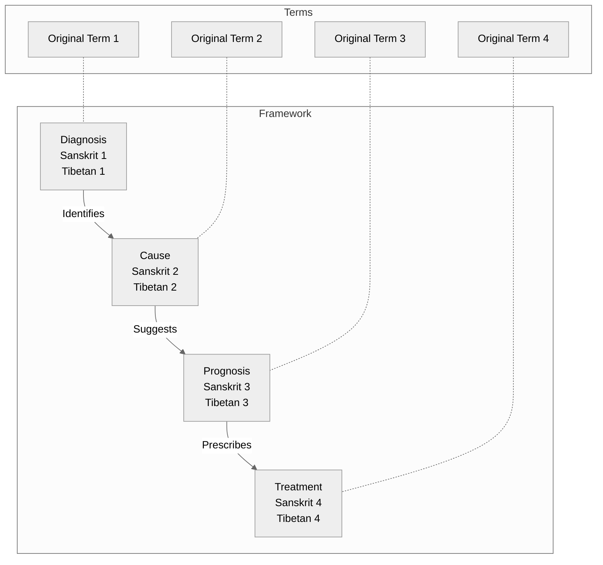

# {name} - Diagnostic View

## Overview
This visualization presents {name} ({tibetan} / {sanskrit}) through a diagnostic framework.

## Visualization

## Description
[Add description of the diagnostic framework shown in the diagram]

## Notes
- Medical analogy explanation
- Traditional usage of this framework
- Key relationships between components