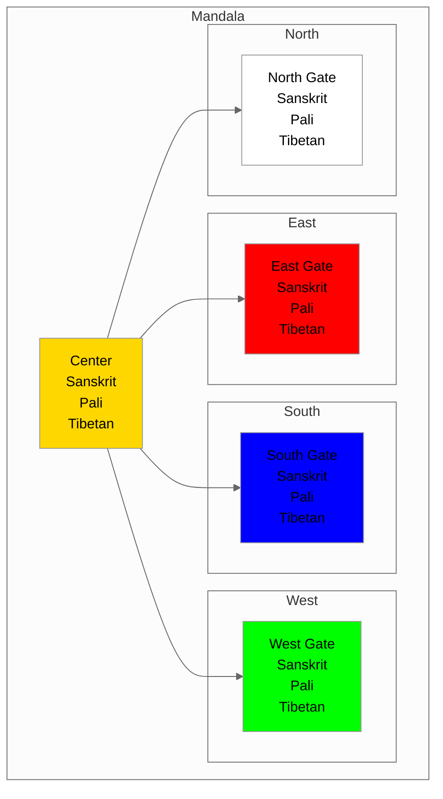

# {name} - Mandala Structure View

## Overview
This visualization presents {name} ({tibetan} / {sanskrit} / {pali}) in traditional mandala format.

## Visualization

## Description
[Add mandala structure description]

## Notes
- Directional significance
- Color symbolism
- Center-periphery relationships
- Traditional applications
- Meditation instructions