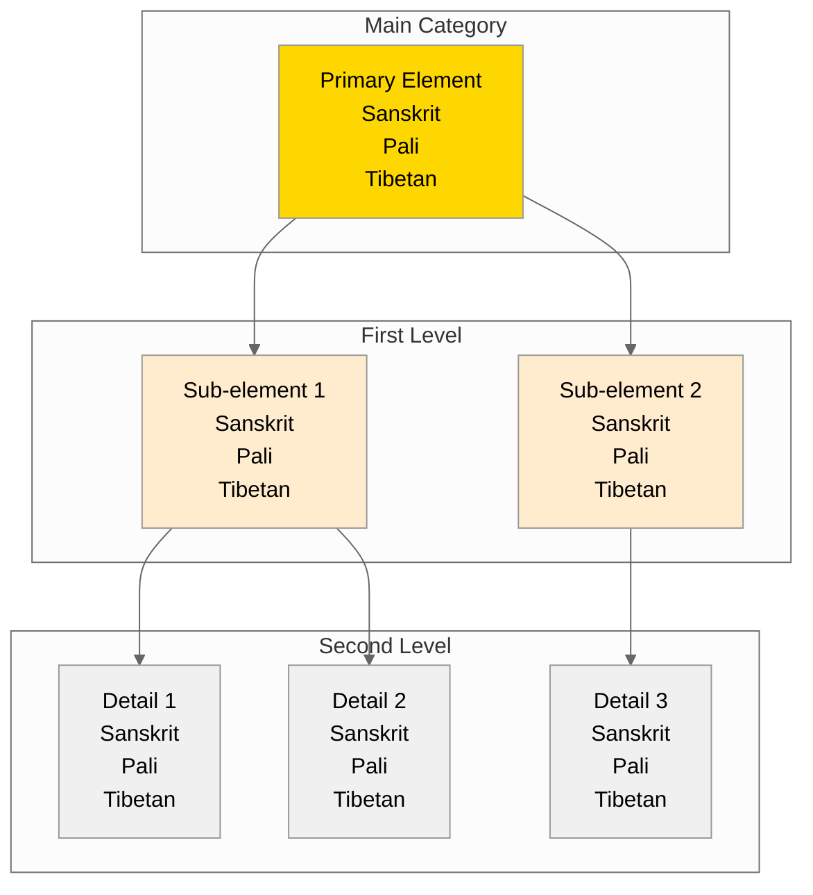

# {name} - Nested Categories View

## Overview
This visualization presents {name} ({tibetan} / {sanskrit} / {pali}) showing hierarchical relationships between categories.

## Visualization

## Description
[Add description of categorical relationships]

## Notes
- Category definitions
- Relationships between levels
- Traditional classifications
- Applications in study and practice