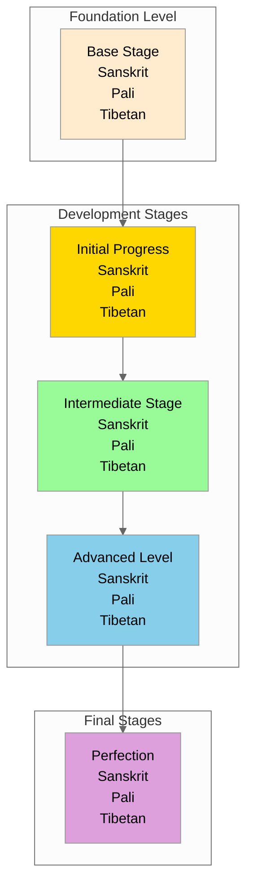

# {name} - Progressive Stages View

## Overview
This visualization presents {name} ({tibetan} / {sanskrit} / {pali}) showing development through stages.

## Visualization

## Description
[Add description of stage progression]

## Notes
- Prerequisites for each stage
- Signs of progress
- Common experiences
- Traditional benchmarks
- Supporting practices