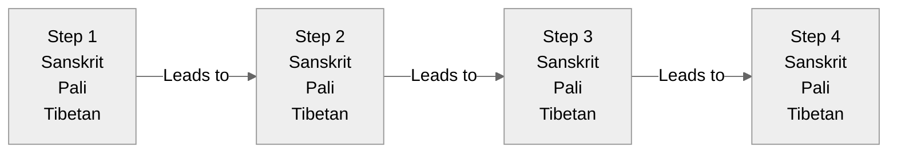

# {name} - Sequential Flow View

## Overview
This visualization presents {name} ({tibetan} / {sanskrit} / {pali}) as a sequential process.

## Visualization

## Description
[Add sequential process description]

## Notes
- Process progression
- Key transitions
- Traditional interpretation