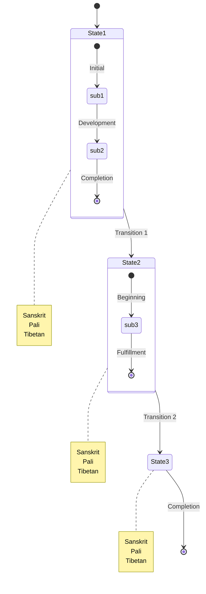

# {name} - State Transitions View

## Overview
This visualization presents {name} ({tibetan} / {sanskrit} / {pali}) as transformational states.

## Visualization

## Description
[Add description of state transformations]

## Notes
- Transition points
- Requirements for progression
- Common obstacles
- Signs of attainment