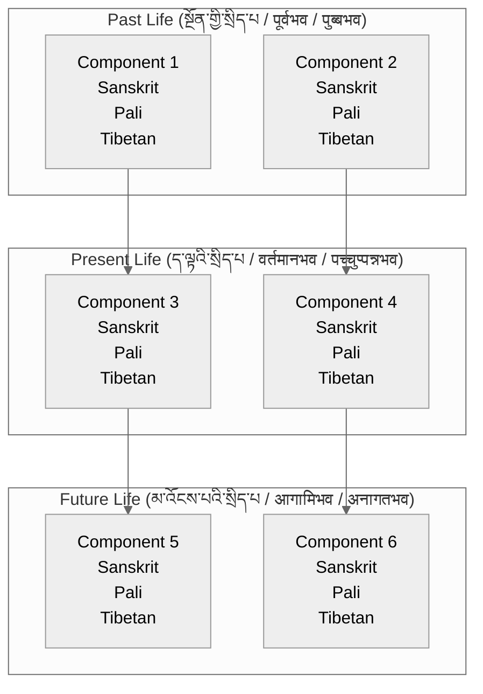

# {name} - Three Lives View

## Overview
This visualization presents {name} ({tibetan} / {sanskrit} / {pali}) across three lifetimes.

## Visualization

## Description
[Add description of how elements connect across lives]

## Notes
- Karmic connections
- Causal links
- Traditional interpretations
- Practice implications