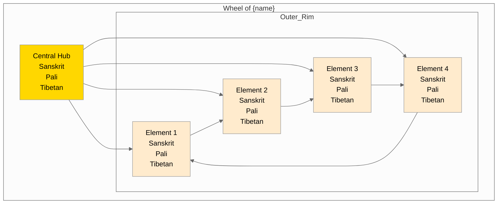

# {name} - Traditional Wheel View

## Overview
This visualization presents {name} ({tibetan} / {sanskrit} / {pali}) in the traditional wheel format.

## Visualization

## Description
[Add wheel structure description]

## Notes
- Hub significance
- Rim elements relationships
- Traditional symbolism
- Meditation applications